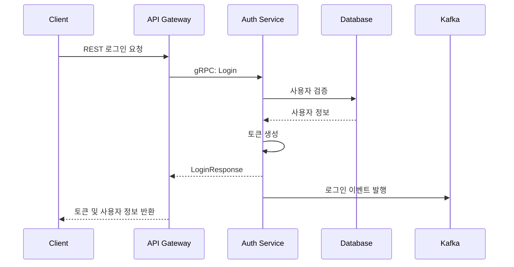
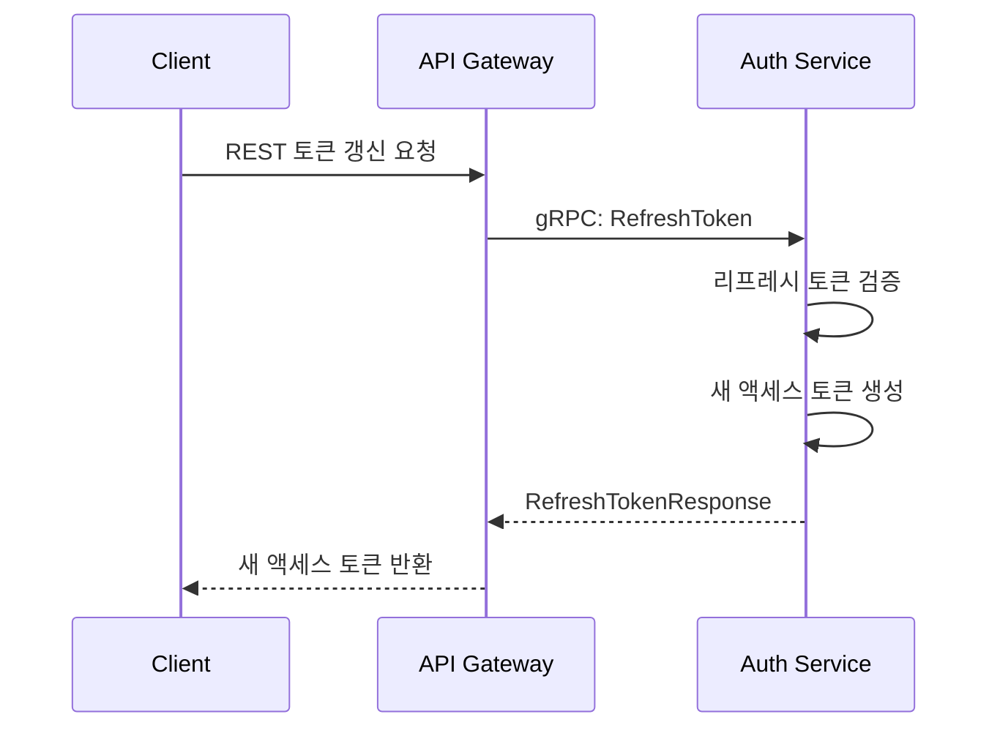

# ImmersiVerse: Authentication Service

## 개요

ImmersiVerse Authentication Service는 플랫폼 내 모든 사용자 인증 및 계정 관리를 담당하는 고성능 마이크로서비스입니다. 이 서비스는 Go 언어로 구현되었으며, 외부 및 내부 통신에는 gRPC를, 비동기 이벤트 처리에는 Kafka를 사용합니다. API 게이트웨이가 RESTful 요청을 gRPC로 변환하여 이 서비스로 전달합니다.

## 아키텍처

### 핵심 컴포넌트

- **gRPC 서버**: 인증 및 사용자 관리 API 제공
- **데이터베이스 계층**: PostgreSQL을 활용한 사용자 및 계정 데이터 관리
- **토큰 관리**: JWT 기반 토큰 생성, 검증 및 관리
- **이벤트 발행자**: Kafka를 통한 인증 이벤트 발행
- **플랫폼 통합**: 다양한 스트리밍 플랫폼 인증 연동 (Twitch, YouTube 등)

### 시스템 상호작용

```
[API 게이트웨이] ←→ [Authentication Service] ←→ [PostgreSQL]
         gRPC                  ↓
                      [기타 마이크로서비스] ←→ [Kafka Event Bus]
                         gRPC / Kafka
```

## 주요 기능

- **사용자 인증**: 사용자명/비밀번호 로그인, OAuth 기반 소셜 로그인
- **토큰 관리**: 액세스 및 리프레시 토큰 발급, 검증, 갱신
- **사용자 관리**: 사용자 등록, 수정, 조회, 비활성화
- **권한 관리**: 역할 기반 접근 제어(RBAC)
- **플랫폼 연동**: 다양한 스트리밍 플랫폼 계정 연결 및 관리
- **이벤트 발행**: 인증 및 사용자 관련 이벤트 발행
- **보안 기능**: 비밀번호 해싱, 속도 제한, 의심스러운 활동 탐지

## 기술 스택

- **언어**: Go 1.23+
- **프레임워크**: gRPC, Protocol Buffers
- **데이터베이스**: PostgreSQL 15
- **메시지 큐**: Apache Kafka
- **캐싱**: Redis
- **CI/CD**: GitHub Actions, ArgoCD
- **컨테이너화**: Docker, Kubernetes
- **모니터링**: Prometheus, Grafana

## 개발 환경 설정

### 필수 요구사항

- Go 1.23 이상
- Docker 및 Docker Compose
- Protocol Buffer 컴파일러(protoc) 및 Go 플러그인
- 개발용 PostgreSQL 및 Kafka 인스턴스

### 빠른 시작

```bash
# 저장소 클론
git clone https://github.com/immersiverse/auth-service.git
cd auth-service

# 의존성 설치
go mod download

# Protocol Buffers 컴파일
make proto

# 개발 환경 설정 (Docker Compose 사용)
docker-compose up -d postgres kafka

# 마이그레이션 실행
make migrate

# 서비스 실행
make run
```

## 프로젝트 구조

```
auth-service/
├── cmd/                    # 애플리케이션 실행 진입점
│   ├── auth-service/       # 인증 서비스 실행 파일
│   │   ├── main.go        # gRPC 서버와 Kafka 초기화
│   │   └── wire.go        # 의존성 주입 설정
│   └── tools/             # 개발 도구 실행 파일
│       └── migrate.go     # DB 마이그레이션 CLI
├── api/                    # 외부 인터페이스 정의 (gRPC)
│   └── proto/             # gRPC 프로토콜 버퍼 정의
│       ├── auth/          # 인증 관련 API 정의
│       │   └── v1/        
│       │       └── auth.proto       # 인증 서비스 정의 (생성 코드 제외)
│       └── platform/      # 플랫폼 연동 관련 API 정의
│           └── v1/
│               └── platform.proto   # 플랫폼 계정 연결 API (생성 코드 제외)
├── internal/               # 내부 구현
│   ├── adapters/          # 외부 시스템 연결
│   │   ├── db/            # 데이터베이스 어댑터
│   │   │   ├── postgres/  # PostgreSQL 구현
│   │   │   │   ├── user_repository.go      # 사용자 데이터 접근
│   │   │   │   ├── token_repository.go     # 토큰 데이터 접근
│   │   │   │   └── platform_repository.go  # 플랫폼 계정 데이터
│   │   │   └── mocks/     # 테스트용 목
│   │   ├── kafka/         # Kafka 이벤트 발행
│   │   │   ├── producer.go         # Kafka Producer
│   │   │   └── mocks/              # 테스트용 목
│   │   ├── redis/         # Redis 캐싱
│   │   │   ├── cache.go           # 캐싱 로직
│   │   │   └── mocks/             # 테스트용 목
│   │   └── grpc/          # gRPC 어댑터
│   │       ├── client/    # 내부 서비스 호출용 클라이언트
│   │       │   └── client.go      # gRPC 클라이언트
│   │       ├── server/    # gRPC 서버
│   │       │   └── server.go      # gRPC 서버 로직
│   │       └── interceptors/      # 인터셉터
│   │           ├── auth.go        # 토큰 검증
│   │           └── logging.go     # 로깅
│   ├── core/              # 도메인 로직
│   │   ├── domain/        # 도메인 모델
│   │   │   ├── user.go            # 사용자 엔티티
│   │   │   ├── token.go           # 토큰 엔티티
│   │   │   ├── platform_account.go # 플랫폼 계정 엔티티
│   │   │   └── events.go          # 도메인 이벤트
│   │   ├── service/       # 애플리케이션 서비스
│   │   │   ├── auth_service.go    # 인증 로직
│   │   │   ├── user_service.go    # 사용자 관리 로직
│   │   │   └── platform_service.go # 플랫폼 연동 로직
│   │   └── ports/         # 도메인 인터페이스
│   │       ├── repository.go      # 저장소 인터페이스
│   │       ├── event_publisher.go # 이벤트 발행 인터페이스
│   │       ├── cache.go           # 캐시 인터페이스
│   │       └── grpc_client.go     # gRPC 클라이언트 인터페이스
│   ├── config/            # 설정 관리
│   │   ├── config.go             # 환경 변수 로드
│   │   └── config.yaml           # 기본 설정
│   ├── middleware/        # 공통 미들웨어
│   │   ├── auth.go               # 토큰 검증
│   │   ├── logging.go            # 로깅
│   │   └── rate_limit.go         # 속도 제한
│   └── generated/         # protoc으로 생성된 gRPC 코드
│       ├── auth/          # 인증 관련 생성 코드
│       │   └── v1/        
│       │       ├── auth.pb.go       # 생성된 Go 코드
│       │       └── auth_grpc.pb.go  # gRPC 서비스 인터페이스
│       └── platform/      # 플랫폼 연동 관련 생성 코드
│           └── v1/
│               ├── platform.pb.go   # 생성된 Go 코드
│               └── platform_grpc.pb.go # gRPC 서비스 인터페이스
├── pkg/                    # 공용 유틸리티
│   ├── crypto/            # 암호화 유틸리티
│   │   ├── hash.go               # 비밀번호 해싱
│   │   └── jwt.go                # JWT 생성/검증
│   ├── logger/            # 로깅 유틸리티
│   │   └── logger.go             # 구조화된 로깅
│   ├── metrics/           # 메트릭 수집
│   │   └── prometheus.go         # Prometheus 메트릭
│   └── validator/         # 입력 검증
│       └── validator.go          # 요청 데이터 검증
├── db/                     # 데이터베이스 관련 파일
│   ├── migrations/        # 스키마 마이그레이션
│   │   ├── 001_init.up.sql       # 초기 테이블 생성
│   │   └── 001_init.down.sql     # 롤백
│   └── seeds/             # 초기 데이터
│       └── users.sql             # 샘플 데이터
├── test/                   # 테스트 코드
│   ├── unit/              # 단위 테스트
│   │   ├── domain/               # 도메인 로직 테스트
│   │   ├── service/              # 서비스 로직 테스트
│   │   └── adapters/             # 어댑터 테스트
│   ├── integration/       # 통합 테스트
│   │   ├── auth_test.go          # 인증 워크플로우 테스트
│   │   └── platform_test.go      # 플랫폼 연동 테스트
│   └── performance/       # 성능 테스트
│       └── load_test.go          # 부하 테스트
├── deployments/            # 배포 관련 파일
│   ├── docker/            # Docker 설정
│   │   ├── Dockerfile            # 서비스 빌드
│   │   └── docker-compose.yml    # 개발용 컴포즈
│   └── kubernetes/        # Kubernetes 매니페스트
│       ├── deployment.yaml       # 배포 설정
│       ├── service.yaml          # 서비스 설정
│       └── configmap.yaml        # 환경 설정
├── docs/                   # 문서
│   ├── architecture/      # 아키텍처 문서
│   ├── api/               # gRPC API 문서
│   ├── development/       # 개발 가이드
│   └── ...                # 기타 문서
├── Makefile               # 빌드 및 개발 작업 자동화
├── go.mod                 # Go 모듈 정의
├── go.sum                 # 의존성 체크섬
├── .gitignore             # Git 무시 패턴
└── README.md              # 프로젝트 개요
```

## 프로젝트 문서

### 설계 및 아키텍처 문서

- [서비스 아키텍처 개요](docs/architecture/overview.md)
- [주요 설계 결정 및 근거](docs/architecture/design-decisions.md)
- [도메인 모델 및 관계 설명](docs/architecture/domain-model.md)
- [데이터 흐름 다이어그램 및 설명](docs/architecture/data-flow.md)
- [서비스 간 통신 패턴](docs/architecture/communication-patterns.md)

### API 및 프로토콜 문서

- [Protocol Buffers 정의 가이드](api/proto/README.md)
- [gRPC 서비스 상세 명세](docs/api/grpc-services.md)
- [에러 코드 및 처리 방법](docs/api/error-codes.md)
- [API 호출 예제](docs/api/examples.md)
- [API 버전 관리 전략](docs/api/versioning.md)

### 개발 가이드

- [개발 환경 설정 가이드](docs/development/setup.md)
- [코드 스타일 가이드](docs/development/style-guide.md)
- [테스트 작성 가이드](docs/development/testing.md)
- [디버깅 가이드](docs/development/debugging.md)
- [기여 가이드라인](docs/development/contribution.md)

### 데이터베이스 문서

- [데이터베이스 스키마 설명](docs/database/schema.md)
- [마이그레이션 전략](docs/database/migrations.md)
- [주요 쿼리 최적화 가이드](docs/database/queries.md)
- [백업 및 복구 전략](docs/database/backups.md)

### 보안 문서

- [인증 흐름 상세 설명](docs/security/authentication-flow.md)
- [토큰 관리 전략](docs/security/token-management.md)
- [비밀번호 정책 및 해싱 전략](docs/security/password-policies.md)
- [공격 방어 전략](docs/security/attack-prevention.md)
- [감사 로깅 정책](docs/security/audit-logging.md)

### 통합 가이드

- [API 게이트웨이 통합 가이드](docs/integration/api-gateway.md)
- [다른 마이크로서비스와의 통합 가이드](docs/integration/other-services.md)
- [Kafka 이벤트 스트림 규격 및 통합 가이드](docs/integration/event-streams.md)
- [외부 플랫폼 통합 가이드](docs/integration/platform-integration.md)

### 운영 문서

- [배포 프로세스 및 환경 설정](docs/operations/deployment.md)
- [Kubernetes 구성 상세 가이드](docs/operations/kubernetes-config.md)
- [모니터링 및 알림 설정](docs/operations/monitoring.md)
- [확장성 및 성능 최적화 가이드](docs/operations/scaling.md)
- [백업 및 복구 절차](docs/operations/backup-recovery.md)
- [재해 복구 계획](docs/operations/disaster-recovery.md)

### 테스트 문서

- [단위 테스트 전략](docs/testing/unit-testing.md)
- [통합 테스트 전략](docs/testing/integration-testing.md)
- [성능 테스트 가이드](docs/testing/performance-testing.md)
- [보안 테스트 가이드](docs/testing/security-testing.md)

### 주요 구현 문서

- [도메인 모델 설계 및 구현 설명](internal/core/domain/README.md)
- [서비스 로직 구현 설명](internal/core/service/README.md)
- [저장소 구현 설명](internal/adapters/db/postgres/README.md)
- [gRPC 서비스 구현 설명](internal/adapters/grpc/README.md)
- [인증 유틸리티 사용 가이드](pkg/crypto/README.md)

### 참조 문서

- [용어 사전](docs/references/glossary.md)
- [외부 의존성 목록 및 버전](docs/references/external-dependencies.md)
- [규정 준수 문서](docs/references/compliance.md)
- [문제 해결 가이드](docs/references/troubleshooting.md)

## 인증 워크플로우

### 1. 사용자 등록 및 로그인



### 2. 토큰 갱신



## gRPC API 명세

```protobuf
service AuthService {
  rpc Login(LoginRequest) returns (LoginResponse);
  rpc Logout(LogoutRequest) returns (LogoutResponse);
  rpc RefreshToken(RefreshTokenRequest) returns (RefreshTokenResponse);
  rpc ValidateToken(ValidateTokenRequest) returns (ValidateTokenResponse);
  
  rpc CreateUser(CreateUserRequest) returns (UserResponse);
  rpc GetUser(GetUserRequest) returns (UserResponse);
  rpc UpdateUser(UpdateUserRequest) returns (UserResponse);
  rpc DeleteUser(DeleteUserRequest) returns (DeleteUserResponse);
  
  rpc ConnectPlatformAccount(ConnectPlatformAccountRequest) returns (PlatformAccountResponse);
  rpc DisconnectPlatformAccount(DisconnectPlatformAccountRequest) returns (DisconnectPlatformAccountResponse);
  rpc GetPlatformAccounts(GetPlatformAccountsRequest) returns (GetPlatformAccountsResponse);
}
```

## 이벤트 토픽

- `auth.events.user_created`: 사용자 생성 이벤트
- `auth.events.user_updated`: 사용자 정보 업데이트 이벤트
- `auth.events.login`: 사용자 로그인 이벤트
- `auth.events.logout`: 사용자 로그아웃 이벤트
- `auth.events.platform_connected`: 플랫폼 계정 연결 이벤트
- `auth.events.platform_disconnected`: 플랫폼 계정 연결 해제 이벤트
- `auth.events.security`: 보안 관련 이벤트

## 보안 고려사항

- 비밀번호는 Argon2id로 해싱
- 액세스 토큰은 RS256으로 서명, 15분 만료
- mTLS를 통한 서비스 간 통신 암호화
- Redis를 활용한 토큰 블랙리스트 관리
- 인증 요청 속도 제한
- IP 기반 의심스러운 활동 탐지

## 모니터링 및 로깅

- **Prometheus 메트릭**:
  - 인증 성공/실패 횟수
  - 토큰 발급/검증 지연 시간
  - 요청 처리량
  - 오류율
- Grafana 대시보드
- 구조화된 JSON 로그
- OpenTelemetry 분산 추적

## 테스트 전략

- **단위 테스트**: 도메인, 서비스, 어댑터 테스트
- **통합 테스트**: DB 및 Kafka 통합 테스트
- **성능 테스트**: 부하 및 스트레스 테스트
- **gRPC 테스트**: API 호출 테스트
- **보안 테스트**: 토큰 검증 및 공격 시도 테스트

## 배포 가이드

### Kubernetes 배포

```bash
# 네임스페이스 생성
kubectl create namespace immersiverse

# 시크릿 생성
kubectl create secret generic auth-secrets \
  --from-literal=jwt-private-key="$(cat private.pem)" \
  --from-literal=jwt-public-key="$(cat public.pem)" \
  --from-literal=db-password="your-password" \
  --namespace immersiverse

# 구성 맵 생성
kubectl apply -f deployments/kubernetes/configmap.yaml

# 서비스 배포
kubectl apply -f deployments/kubernetes/deployment.yaml
kubectl apply -f deployments/kubernetes/service.yaml
```

## 기여 가이드라인

1. 이슈 트래커 확인 및 이슈 생성
2. `main` 브랜치에서 `feature/기능명` 브랜치 생성
3. 코드 작성 및 테스트 추가
4. 테스트 통과 확인
5. 커밋 및 푸시
6. Pull Request 생성
7. 코드 리뷰 및 피드백 반영
8. 병합

## 라이센스

Proprietary 라이센스, ImmersiVerse 승인 없이 사용/수정/배포 불가.

## 연락처

기술 문의: [dev@immersiverse.com](mailto:dev@immersiverse.com)