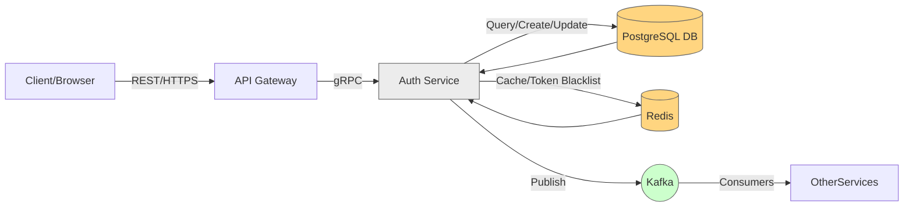
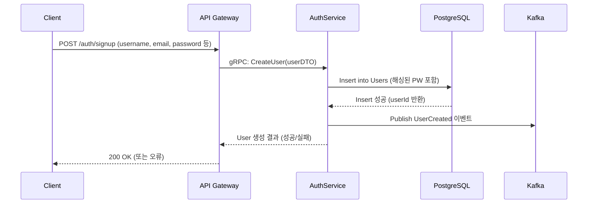
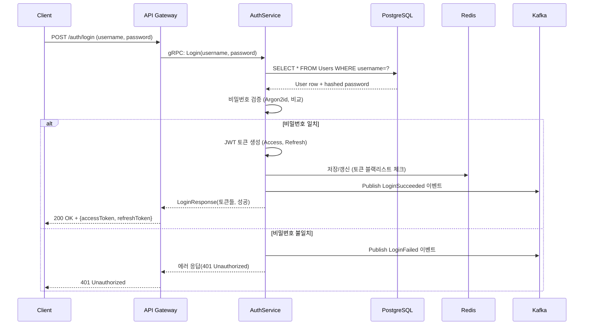
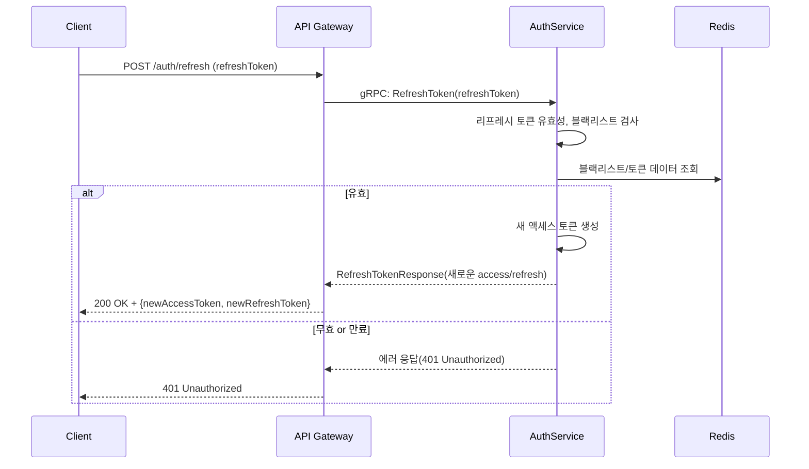
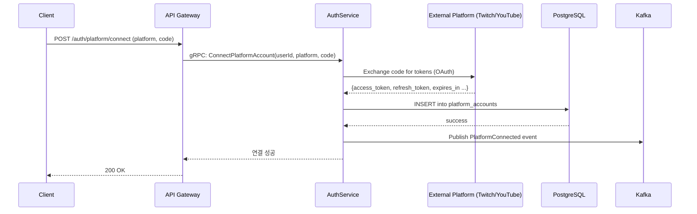
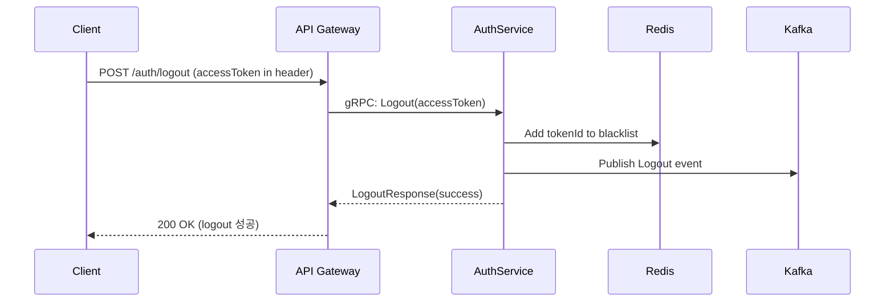

# Authentication Service: 데이터 흐름 다이어그램 및 설명

본 문서는 **ImmersiVerse Authentication Service**에서 발생하는 주요 데이터 흐름(요청-응답, DB 액세스, 이벤트 발행)을 시각화하고, 각 단계에서 어떤 데이터가 어떻게 처리되는지 자세히 설명합니다. 이를 통해 팀원들이 인증 서비스의 동작 방식과 외부 서비스(또는 플랫폼)와의 상호 작용을 쉽게 이해할 수 있습니다.

---

## 1. 전체 아키텍처 개요 (High-Level Data Flow)

다음은 인증 서비스에 대한 고수준 데이터 흐름 다이어그램입니다. 실제 세부 시나리오는 이후 장에서 더욱 상세히 다루지만, 전반적으로 **사용자 요청**(로그인, 회원가입 등)이 **API 게이트웨이**를 거쳐 **Auth Service**로 전달되고, 필요한 경우 **데이터베이스(DB)**, **Redis**, **Kafka** 이벤트 발행 등이 수행되는 구조입니다.



1. **Client**는 **API Gateway**(Envoy Proxy 등)를 통해 HTTP/REST로 요청  
2. **API Gateway**는 내부적으로 **Auth Service**에 gRPC 호출  
3. **Auth Service**는 DB, Redis, 그리고 이벤트 시스템(Kafka)과 상호 작용  
4. Kafka를 통해 다른 마이크로서비스 또는 외부 시스템과 비동기 이벤트 통합  

---

## 2. 사용자 가입(회원가입) 흐름 (User Registration)

사용자가 새 계정을 만들 때의 전형적인 데이터 흐름을 설명합니다.

### 2.1 Sequence Diagram



### 2.2 요약

1. **Client**가 회원가입 폼 전송  
2. **API Gateway**가 gRPC로 `AuthService.CreateUser` 호출  
3. AuthService 내에서 **비밀번호 해싱** 후 `Users` 테이블에 Insert  
4. 가입 성공 시, **Kafka**에 `UserCreated` 이벤트 발행  
5. API Gateway가 결과를 클라이언트에 반환  

**데이터 포인트**:  
- DB에 새 `User` 레코드 생성(`passwordHash`는 Argon2id로 해싱)  
- Kafka 토픽 `auth.events.user_created` 발행  

---

## 3. 로그인(Authenticate) 흐름

### 3.1 Sequence Diagram



### 3.2 요약

1. **Client**가 로그인 정보를 보내면  
2. **Auth Service**가 DB에서 해당 사용자 조회 → 비밀번호 검증  
3. 성공 시, **JWT 토큰**(Access/Refresh) 생성 → Redis에 일부 정보 캐싱(또는 블랙리스트 확인)  
4. **Kafka**에 성공/실패 이벤트 발행(통계, 모니터링 목적)  
5. 결과(성공 시 토큰, 실패 시 오류)를 **API Gateway** 통해 클라이언트로 반환  

---

## 4. 토큰 갱신(Token Refresh) 흐름

액세스 토큰 만료 시, 리프레시 토큰을 사용해 새 액세스 토큰을 발급받는 과정.

### 4.1 Sequence Diagram



### 4.2 요약

1. **Client**가 만료된 액세스 토큰을 대신할 새 토큰을 요청  
2. AuthService가 **리프레시 토큰** 검증(서명, 블랙리스트, 만료 여부)  
3. **유효**하면 새 액세스 토큰과 리프레시 토큰을 발급하고 반환  
4. **무효**면 401 에러  

---

## 5. 플랫폼 계정 연동(Platform Account Integration) 흐름

트위치, 유튜브 등 외부 플랫폼과 OAuth 과정을 통해 계정을 연결하는 시나리오.

### 5.1 Sequence Diagram



### 5.2 요약

1. **사용자**가 특정 플랫폼(Twitch, YouTube 등) 연동을 요청  
2. **AuthService**가 해당 플랫폼의 OAuth 엔드포인트를 호출해 코드 교환 후 액세스 토큰 획득  
3. **DB**에 새 `platform_accounts` 레코드 추가  
4. `PlatformConnected` 이벤트 발행  
5. **성공 응답**을 클라이언트에게 반환  

---

## 6. 로그아웃 및 토큰 무효화(Logout) 흐름

사용자가 명시적으로 로그아웃하면, 현재 액세스 토큰 및 리프레시 토큰을 블랙리스트에 등록해 무효화할 수 있습니다.

### 6.1 Sequence Diagram



### 6.2 요약

1. **Client**가 Logout 요청  
2. AuthService가 액세스 토큰에 포함된 JWT ID(JTI) 등을 추출, **블랙리스트**에 추가  
3. 만료 전까지 해당 토큰 무효 처리  
4. Kafka에 `Logout` 이벤트 발행, 보안 로그 남김  

---

## 7. 이벤트 발행(Evening Publishing) 흐름

인증 서비스에서 중요한 상태 변경(회원가입, 로그인 성공/실패 등)이 발생하면 `auth.events.*` 토픽으로 이벤트를 발행합니다.

### 7.1 수신 측 구성

- **Analytics Service**: 이벤트 수신해 통계/보고에 활용
- **Logging & Monitoring**: AI 기반 이상 로그인 감지
- **UserProfile Service**: 확장 사용자 정보 싱크 등

### 7.2 이벤트 형식

예: `UserCreated`, `LoginSucceeded`, `PlatformConnected` 등. JSON 형태로 직렬화(또는 Proto 메시지) 하여 Kafka 토픽에 담김.

```json
{
  "eventType": "UserCreated",
  "timestamp": "2025-05-12T10:15:30Z",
  "payload": {
    "userId": "uuid-1234-5678",
    "username": "immersiveStreamer",
    "email": "streamer@immersiverse.com"
  }
}
```

---

## 8. 주요 데이터 저장 및 캐싱 포인트

1. **PostgreSQL**  
   - 사용자 정보(`users`), 플랫폼 계정(`platform_accounts`), 토큰 블랙리스트(`token_blacklist`), 감사 로그(`audit_logs`)  
2. **Redis**  
   - 토큰 캐싱(액세스 토큰/리프레시 토큰 저장, 블랙리스트), rate limiting(로그인 시도 등)  
3. **Kafka**  
   - `auth.events.*` 토픽에 이벤트 발행 (가입, 로그인, 플랫폼 연결 등)

---

## 9. 에러 처리 및 예외 시나리오

- **DB 장애**: User/PlatformAccount Insert/Select 실패 시 500 에러 반환, 재시도 로직?  
- **Redis 연결 실패**: 토큰 블랙리스트 조회/갱신 불가 시, fallback 처리(특정 환경에서는 추가 검증)  
- **Kafka 전송 실패**: 이벤트 발행 실패 시 재시도 정책 적용(최대 N번), 로그 경고 남김  
- **OAuth 외부 플랫폼 장애**: `PlatformIntegrationDomainService`에서 예외 처리 & 에러 응답(플랫폼 연결 불가 메시지)

---

## 10. 결론 및 활용

본 문서에서 살펴본 **데이터 흐름**은 Auth Service가 수행하는 주요 기능과 시스템 간 연동 과정을 단계별로 보여줍니다.  
- 실제 개발 및 유지보수 시, 이 **시나리오별 흐름**을 참고하면 버그 트래킹, 기능 확장, 성능 최적화 등에 유용하게 활용할 수 있습니다.  
- **시나리오별 테스트 케이스**를 도출하거나, **성능 테스트** 시 부하 지점을 식별하는데도 본 문서를 참고하면 좋습니다.