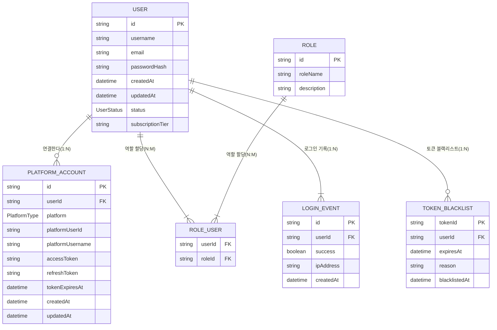

# Authentication Service Domain Model

본 문서는 ImmersiVerse Authentication Service의 **도메인 모델**을 정의합니다. 도메인 모델은 인증(로그인, 로그아웃, 토큰, 권한 관리 등)과 사용자 관리, 플랫폼 계정 연동 등의 핵심 비즈니스 로직을 포괄하며, 도메인 엔티티와 이들 간의 관계, 해당 엔티티를 운영하는 도메인 서비스 / 밸류 오브젝트(VO) / 이벤트 등을 설명합니다.

## 1. 개요

ImmersiVerse Authentication Service는 **사용자(User)** 를 중심으로 **플랫폼 계정(PlatformAccount)**, **권한(Role)**, **토큰(Token)** 등의 엔티티를 관리하고, 인증 및 권한 부여, 계정 연동, 로그인 이벤트 등의 핵심 기능을 제공합니다. 본 문서에서는 이들 도메인 개체와 상호 작용을 구조적으로 이해할 수 있도록 도메인 모델과 관계를 정리합니다.

## 2. 도메인 모델 다이어그램

아래 다이어그램은 주요 엔티티와 그 관계를 나타냅니다. (Mermaid 예시)

> **참고**: 위 다이어그램은 예시이며, 실제 DB 스키마나 컬럼명 등은 기존 문서에서 정의한 사항과 다를 수 있습니다.

## 3. 주요 엔티티 (Entities)

### 3.1 User

- **설명**: ImmersiVerse 시스템에서 가장 기본적인 주체(사용자) 엔티티로, 방송인(스트리머), 일반 사용자를 포함한 모든 가입 회원을 표현합니다.  
- **주요 속성**:
  - `id`: (PK) 고유 식별자 (UUID)
  - `username`: 사용자명 (고유)
  - `email`: 이메일 (고유)
  - `passwordHash`: Argon2id 등의 알고리즘으로 해싱한 비밀번호
  - `status`: 계정 활성 상태(`ACTIVE`, `SUSPENDED`, `DELETED` 등)
  - `subscriptionTier`: 구독 티어(`FREE`, `BASIC`, `PREMIUM`, etc.)
  - `createdAt`, `updatedAt`: 생성/수정 시각
- **주요 규칙/제약**:
  - username, email은 고유(unique)해야 함
  - 비밀번호는 반드시 해싱되어 저장
  - 상태 변화 시 도메인 이벤트(`UserStatusChanged`) 발생 가능

### 3.2 PlatformAccount

- **설명**: 외부 스트리밍 플랫폼(Twitch, YouTube, Facebook, Afreeca 등) 계정을 ImmersiVerse User에 연결해 주는 엔티티.  
- **주요 속성**:
  - `id`: (PK) 고유 식별자 (UUID)
  - `userId`: 연결된 `User.id` (FK)
  - `platform`: 플랫폼 종류 (Enum: `TWITCH`, `YOUTUBE`, `FACEBOOK`, `AFREECA` 등)
  - `platformUserId`, `platformUsername`: 해당 플랫폼에서의 사용자 식별 정보
  - `accessToken`, `refreshToken`: OAuth 접근 토큰, 리프레시 토큰
  - `tokenExpiresAt`: 토큰 만료 시각
  - `createdAt`, `updatedAt`: 생성/수정 시각
- **주요 규칙/제약**:
  - 한 사용자가 여러 플랫폼 계정(다계정) 연결 가능 (1:N)
  - 각 플랫폼은 OAuth 2.0 API를 통해 연동
  - 토큰 갱신 로직 필요 (만료 시 토큰 재발행)

### 3.3 Role / RoleUser(N:M 관계)

- **설명**: RBAC(Role-Based Access Control)을 위한 엔티티. 사용자는 여러 역할을 가질 수 있고, 각 역할은 여러 사용자에게 할당될 수 있음.  
- **주요 속성**:
  - `Role`
    - `id`: (PK)
    - `roleName`: 역할 이름 (예: `ADMIN`, `MODERATOR`, `STREAMER`, `USER` 등)
    - `description`: 역할 설명
  - `RoleUser`
    - `userId`: `User.id` 참조
    - `roleId`: `Role.id` 참조
- **주요 규칙/제약**:
  - 역할에 따라 접근 가능한 기능이 다름
  - 관리자 `ADMIN` 역할은 전체 권한 가능
  - 일반 `USER` 역할은 기본 권한만 부여

### 3.4 Token / TokenBlacklist

- **Token (도메인 오브젝트로만 존재할 수 있음)**  
  - DB에 직접 저장하기보다는, JWT 등 토큰 문자열을 생성/검증 시 사용  
  - 액세스 토큰, 리프레시 토큰으로 나뉘며, RSA/RS256 등 비대칭키로 서명  
  - 만료 시각, 발급 시각, 사용자 정보 등의 클레임 포함  

- **TokenBlacklist**  
  - **설명**: 만료 전 무효화(블랙리스트)된 토큰 관리  
  - **주요 속성**:
    - `tokenId`: JWT의 JTI(토큰 ID) 혹은 해싱된 값
    - `userId`: 사용자 식별자
    - `expiresAt`: 블랙리스트가 유효한 만료 시각
    - `reason`: 블랙리스트에 추가된 이유 (사용자가 로그아웃했거나, 보안 우려 등)
    - `blacklistedAt`: 블랙리스트 등록 시각

### 3.5 LoginEvent

- **설명**: 사용자 로그인 시도 및 결과를 기록하기 위한 엔티티 (감사 로그 혹은 통계용)  
- **주요 속성**:
  - `id`: (PK)
  - `userId`: 로그인 대상 사용자
  - `success`: 성공/실패 여부
  - `ipAddress`: 시도한 IP 정보
  - `createdAt`: 이벤트 발생 시각
- **주요 규칙/제약**:
  - 관리자/보안 모니터링 용도로 사용
  - 로그인 실패가 일정 횟수 초과 시 계정 잠금 등의 비즈니스 로직과 연계 가능

## 4. 값 객체(Value Objects)

### 4.1 Password

- **설명**: 비밀번호 해싱/검증 로직을 캡슐화하기 위한 VO
- **내부 속성**:
  - `hashedValue`: Argon2id 등으로 해싱된 결과
  - `salt`: 솔트 값(별도로 저장될 수도 있음)
  - `pepper`: 서비스 전체 공통으로 사용하는 추가 시크릿(옵션)
- **주요 기능**:
  - `Validate(rawPassword)`: 입력된 비밀번호가 해시와 동일한지 검증
  - `Change(rawPassword)`: 새 비밀번호 설정 시 해싱 처리

### 4.2 Email

- **설명**: 이메일 유효성 검증, 정규화, 도메인 추출 등을 캡슐화
- **주요 기능**:
  - `IsValid()`: 이메일 형식 검증
  - `GetDomain()`: 이메일 도메인 부분 추출
  - `Normalize()`: 대소문자 정규화 등

## 5. 도메인 서비스(Domain Services)

### 5.1 UserDomainService

- **역할**: 사용자 생성, 프로필 업데이트, 상태 변경 등 `User` 엔티티에 관련된 비즈니스 로직 수행
- **주요 기능**:
  - `CreateUser(userDTO)`: 중복 검증, 비밀번호 해싱, 이벤트 발행
  - `ChangeUserStatus(userId, newStatus)`: 상태 변경 시 비즈니스 규칙(활성화/정지 등) 적용
  - `AssignRole(user, role)`: 사용자에게 역할 부여

### 5.2 PlatformIntegrationDomainService

- **역할**: 외부 플랫폼 계정 연결/해제, OAuth 토큰 갱신 등
- **주요 기능**:
  - `ConnectPlatformAccount(user, platform, authCode)`: OAuth 코드 교환 → `PlatformAccount` 생성/업데이트
  - `RefreshPlatformToken(platformAccount)`: 만료 시 액세스 토큰 재발급
  - `DisconnectPlatformAccount(user, platformId)`: 연결 해제 로직

### 5.3 AuthenticationDomainService

- **역할**: 로그인/로그아웃, 토큰 검증 등 인증 로직
- **주요 기능**:
  - `Login(username, password)`: 비밀번호 검증 → 토큰 생성 → `LoginEvent` 발행
  - `Logout(tokenId)`: 토큰 블랙리스트 추가
  - `ValidateToken(token)`: 토큰 유효성, 블랙리스트 여부 검증
  - `RefreshToken(refreshToken)`: 리프레시 토큰 검증 후 새로운 토큰 쌍 발급

## 6. 도메인 이벤트

도메인 이벤트는 엔티티 상태 변경(혹은 비즈니스 이벤트)이 발생했을 때 발행되며, Kafka를 통해 다른 마이크로서비스와 비동기 통합이 가능합니다.

- `UserCreated`
- `UserUpdated`
- `UserStatusChanged`
- `LoginSucceeded`
- `LoginFailed`
- `PlatformConnected`
- `PlatformDisconnected`

이벤트는 **EventPublisher**를 통해 메시지 큐(Kafka)에 발행되며, 다른 서비스에서 이를 수신/처리할 수 있습니다.

## 7. 관계 및 제약 요약

- **User - PlatformAccount**: `1:N`  
  한 명의 유저는 여러 플랫폼 계정을 가질 수 있다.
- **User - Role**: `N:M` (중간 테이블 `RoleUser` 사용)  
  유저는 여러 역할을 가질 수 있으며, 역할도 여러 유저에게 할당될 수 있다.
- **User - TokenBlacklist**: `1:N`  
  한 명의 유저는 여러 블랙리스트 토큰 항목을 남길 수 있다.
- **User - LoginEvent**: `1:N`  
  유저별로 여러 로그인 이벤트가 발생 가능하다.

## 8. 도메인 모델 활용 시나리오

1. **사용자 회원가입**  
   - `UserDomainService.CreateUser(userDTO)` 호출  
   - 중복 체크, 비밀번호 해싱 후 `User` 엔티티 생성  
   - `UserCreated` 이벤트 발행  

2. **로그인**  
   - `AuthenticationDomainService.Login(username, password)`  
   - 비밀번호 검증 후 토큰 생성  
   - `LoginSucceeded` 또는 `LoginFailed` 이벤트 발행  
   - 리턴 값으로 액세스 토큰/리프레시 토큰 제공  

3. **플랫폼 계정 연결**  
   - `PlatformIntegrationDomainService.ConnectPlatformAccount(user, platform, authCode)`  
   - OAuth 2.0 인증 → `PlatformAccount` 엔티티 생성  
   - `PlatformConnected` 이벤트 발행  

4. **토큰 검증**  
   - `AuthenticationDomainService.ValidateToken(token)`  
   - JWT 서명 검증, 만료 여부, 블랙리스트 확인  
   - 성공 시 사용자 ID 등 클레임 반환  

## 9. 확장/변경 시 고려사항

- **추가 플랫폼 연동**: `PlatformAccount` 엔티티에 `platform` 필드를 Enum으로 관리 중이나, 플랫폼 추가 시 Enum 확장 필요 → Enum 확장이 빈번하면 별도 테이블로 분리 검토
- **추가 도메인 이벤트**: 서비스 간 비동기 협업 증가 시 새로운 이벤트가 추가될 수 있음  
- **역할/권한 확장**: 시스템 권한 체계가 복잡해지면 `Role` → `Permission` 레벨로 세분화 검토  
- **CQRS 세분화**: 인증 로직 외에 **Read Model**(e.g. 통계, 대시보드 등) 이 더 복잡해지면 CQRS 확장을 고려 가능  

## 10. 결론

본 문서는 Authentication Service의 도메인 모델과 엔티티 간 관계를 체계적으로 정리한 것입니다. **도메인 모델**은 비즈니스 로직 구현의 중심이며, 유지보수와 확장 시 핵심 참조 자료로 활용됩니다.  
- **엔티티**(User, PlatformAccount, Role 등)와 **VO**(Password, Email), **도메인 서비스**(UserDomainService, AuthenticationDomainService, 등)를 명확히 구분해 복잡성을 관리합니다.  
- **도메인 이벤트** 기반의 비동기 통합으로 서비스 간 결합도를 낮추고 확장성을 높였습니다.  
- **UML/ERD 다이어그램**으로 관계를 시각화하여, 팀원들이 빠르게 구조를 이해하고 협업할 수 있도록 지원합니다.