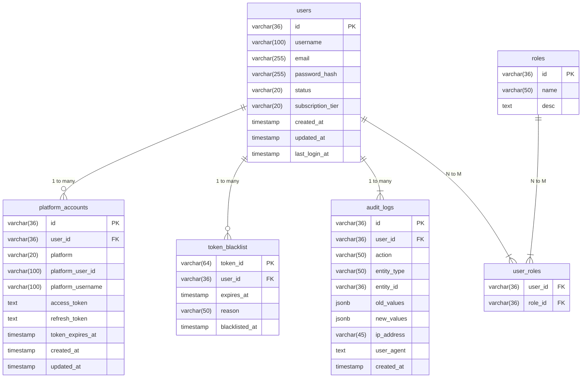

# 데이터베이스 스키마 설명

본 문서는 **ImmersiVerse Authentication Service**에서 사용하는 **데이터베이스 구조**를 정리합니다. 주요 테이블, 컬럼, 제약조건, 인덱스 구성 등을 문서화하여, 개발·운영 시 일관된 기준을 제공합니다.

---

## 1. 개요

- **DB 엔진**: PostgreSQL 15.x
- **스키마명**: (optional) `auth` (또는 디폴트 `public`)
- **마이그레이션 툴**: 예: golang-migrate, Flyway 등
- **주요 테이블**:
  1. `users`  
  2. `platform_accounts`  
  3. `token_blacklist`  
  4. `audit_logs`  
  5. (선택) `roles`, `user_roles`

---

## 2. 테이블 개요

### 2.1 users

**목적**: ImmersiVerse 내 사용자(스트리머, 일반 사용자) 기본 정보 저장

| 컬럼명         | 타입         | 설명                                  | 예시               |
|---------------|-------------|---------------------------------------|--------------------|
| `id`          | `VARCHAR(36)` PK | 고유 식별자 (UUID)                     | `"uuid-1234-5678"` |
| `username`    | `VARCHAR(100)` | 유저명 (unique)                       | `"myUser"`         |
| `email`       | `VARCHAR(255)` | 이메일 (unique)                       | `"user@example.com"`|
| `password_hash` | `VARCHAR(255)` | Argon2id 등 해싱 비밀번호 저장          |                    |
| `status`      | `VARCHAR(20)` | 계정 상태(`ACTIVE`, `SUSPENDED` 등)    | `"ACTIVE"`         |
| `subscription_tier` | `VARCHAR(20)` | 구독 티어(`FREE`, `PREMIUM` 등)        | `"FREE"`           |
| `created_at`  | `TIMESTAMP` NOT NULL | 생성 시각                             |                    |
| `updated_at`  | `TIMESTAMP` NOT NULL | 수정 시각                             |                    |
| `last_login_at` | `TIMESTAMP` | 최근 로그인 시각                       |                    |

- **인덱스**:
  - `UNIQUE (username)`, `UNIQUE (email)`
  - 상황에 따라 `status` 등으로 Filter 필요 시 B-Tree 인덱스 추가
- **비고**:
  - `password_hash`는 반드시 해싱 값만 저장, 평문 비밀번호 금지  
  - `status` 변경 시 audit log 가능

### 2.2 platform_accounts

**목적**: 유저당 외부 플랫폼(Twitch, YouTube 등) 계정 연동 정보 저장

| 컬럼명            | 타입           | 설명                                   |
|-------------------|---------------|----------------------------------------|
| `id`              | `VARCHAR(36)` PK | 고유 식별자 (UUID)                      |
| `user_id`         | `VARCHAR(36)` FK | 연결된 `users.id`                       |
| `platform`        | `VARCHAR(20)` | 플랫폼명(`TWITCH`, `YOUTUBE`, `AFREECA` 등) |
| `platform_user_id` | `VARCHAR(100)` | 외부 플랫폼에서의 사용자 ID             |
| `platform_username` | `VARCHAR(100)` | 외부 플랫폼에서의 닉네임                |
| `access_token`    | `TEXT`        | OAuth 액세스 토큰                       |
| `refresh_token`   | `TEXT`        | OAuth 리프레시 토큰                      |
| `token_expires_at` | `TIMESTAMP`  | 토큰 만료 시각                           |
| `created_at`      | `TIMESTAMP` NOT NULL | 생성 시각                             |
| `updated_at`      | `TIMESTAMP` NOT NULL | 수정 시각                             |

- **FK 제약**: `FOREIGN KEY (user_id) REFERENCES users(id) ON DELETE CASCADE`
- **인덱스**:
  - 자주 조회하는 `platform_user_id` 등 필요 시 인덱스 생성
- **비고**:
  - 한 유저 다계정(1:N)
  - OAuth 갱신 로직에 따라 `token_expires_at` 주기적 업데이트

### 2.3 token_blacklist

**목적**: 만료 전 무효화된 JWT를 관리(로그아웃, 보안 이유 등)

| 컬럼명        | 타입           | 설명                                   |
|--------------|---------------|----------------------------------------|
| `token_id`   | `VARCHAR(64)` PK | JWT의 JTI(토큰 ID) 혹은 해싱된 토큰 ID    |
| `user_id`    | `VARCHAR(36)` | 해당 토큰 소유자(`users.id`)             |
| `expires_at` | `TIMESTAMP`  | 블랙리스트 만료 시각(토큰 원래 만료와 일치) |
| `reason`     | `VARCHAR(50)` | 블랙리스트 사유(`logout`, `compromised` 등) |
| `blacklisted_at` | `TIMESTAMP` NOT NULL | 등록 시각                             |

- **FK 제약**: `(user_id)` → `users(id)` (ON DELETE CASCADE) or SET NULL (팀 결정)
- **인덱스**:
  - `PRIMARY KEY(token_id)`
  - `user_id` 인덱스 (빈도 낮으면 선택)
- **비고**:
  - Redis 등 인메모리 캐시와 병행 사용 시, DB는 영구 기록 역할
  - `expires_at` 이후 정기적 clean-up 가능

### 2.4 audit_logs

**목적**: 주요 행동(계정 생성, 권한 변경, 설정 변경 등)에 대한 감사 기록

| 컬럼명        | 타입           | 설명                                           |
|--------------|---------------|------------------------------------------------|
| `id`         | `VARCHAR(36)` PK | 감사 로그 고유 식별자                            |
| `user_id`    | `VARCHAR(36)` | 작업을 수행한 사용자(선택적으로 NULL 가능)        |
| `action`     | `VARCHAR(50)` | 동작/행위 명 (`CREATE_USER`, `CHANGE_STATUS` 등) |
| `entity_type` | `VARCHAR(50)` | 대상 엔티티 종류 (`USER`, `PLATFORM_ACCOUNT`, 등) |
| `entity_id`  | `VARCHAR(36)` | 대상 엔티티 PK                                  |
| `old_values` | `JSONB`       | 변경 전 데이터 스냅샷(선택사항)                   |
| `new_values` | `JSONB`       | 변경 후 데이터 스냅샷(선택사항)                   |
| `ip_address` | `VARCHAR(45)` | IPv4/IPv6 추적 (선택사항)                        |
| `user_agent` | `TEXT`        | 클라이언트 UA(선택사항)                          |
| `created_at` | `TIMESTAMP` NOT NULL | 감사 발생 시각                           |

- **FK**: `(user_id) → users(id)` (ON DELETE SET NULL) → 유저 삭제 후에도 로그는 보존
- **인덱스**:
  - `action`, `entity_type`, `entity_id` 등 필드에 대한 조회가 잦으면 인덱스 추가 고려
- **비고**:
  - JSONB는 유연한 구조 저장 가능
  - 로그 보관 주기/용량 관리는 팀 정책에 따라

### (선택) 2.5 roles, user_roles

**목적**: RBAC(Role-Based Access Control) 구현 시

**`roles`** table:

| 컬럼명    | 타입         | 설명                                 |
|----------|-------------|--------------------------------------|
| `id`     | `VARCHAR(36)` PK | Role 식별자                         |
| `name`   | `VARCHAR(50)` UNIQUE | 역할명(`ADMIN`, `MODERATOR`, etc.) |
| `desc`   | `TEXT`       | 역할 설명                            |

**`user_roles`** table (N:M 관계):

| 컬럼명    | 타입         | 설명                           |
|----------|-------------|--------------------------------|
| `user_id` | `VARCHAR(36)` | FK -> users.id                |
| `role_id` | `VARCHAR(36)` | FK -> roles.id                |
| (PK 복합) | (user_id, role_id) | 2차 유니크 키                 |

---

## 3. 관계 다이어그램 (ERD)

(예시 Mermaid)

---

## 4. 인덱스 전략

1. **PK/Unique Index**:
   - `users.pk(id)`, unique(username), unique(email)
   - `platform_accounts.pk(id)`, possibly unique(platform, platform_user_id)
2. **Foreign Key**:
   - `platform_accounts.user_id -> users.id`
   - `token_blacklist.user_id -> users.id`
3. **Additional**:
   - If frequent queries on `status` or `created_at`, consider B-Tree index.

---

## 5. 마이그레이션/버전 관리

- **db/migrations** 디렉토리:
  - e.g. `0001_create_users.up.sql`, `0001_create_users.down.sql`
- Deploy/CI 시 `make migrate` or `golang-migrate up` 실행
- 새 스키마 변경 시(테이블/컬럼 추가, 인덱스 추가 등) **새로운 migration 파일** 생성, 기존은 수정 X

---

## 6. 보안/암호화 고려

- **비밀번호**: Argon2id 해싱 결과만 `users.password_hash`에 저장
- **민감 데이터**(토큰, secrets): 가급적 **TEXT**/**AES**로 DB at-rest encryption or KMS
- **접근 제어**:
  - DB 계정 최소 권한(INSERT, UPDATE only on relevant tables)
  - SSL/TLS DB 커넥션

---

## 7. 운영 가이드

1. **백업/복구**:
   - PostgreSQL base backup or PITR(WAL logs)
   - 정기 백업 + 모니터링
2. **청소 정책**:
   - `token_blacklist`에서 `expires_at` 지난 레코드 주기적 삭제
   - `audit_logs` 오래된 기록(1년↑) 보관 정책
3. **성능 최적화**:
   - 적절한 인덱스, VACUUM 설정, `pg_stat_statements` 모니터링
   - DB connection pool (e.g. `max_connections`, `idle_timeout`)

---

## 8. 결론

**Authentication Service**에서 사용되는 PostgreSQL 스키마는 **`users`, `platform_accounts`, `token_blacklist`, `audit_logs`**(및 옵션 `roles`, `user_roles`)가 핵심입니다.  
- 고유 제약(unique email/username), FK, 인덱스를 통해 **데이터 무결성**과 **성능**을 확보  
- 마이그레이션 파일을 통해 **버전 관리**하며, 보안(비밀번호 해싱, 민감 정보 보호)에도 유의