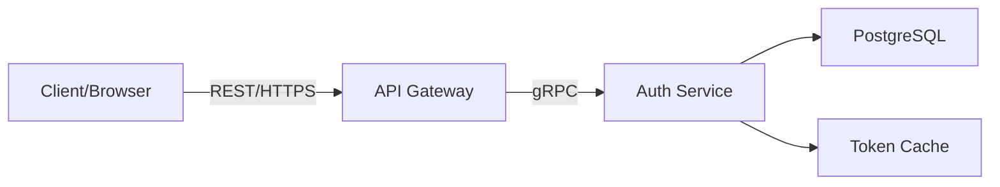

# API 게이트웨이 통합 가이드

본 문서는 **ImmersiVerse Authentication Service**와 **API Gateway** 간의 통합 방식을 정리합니다. **REST ↔ gRPC** 변환, 인증·권한 처리, 라우팅 규칙, 그리고 각 단계별 보안 고려사항 등을 다루며, Gateway를 통해 외부(클라이언트)와 Auth Service가 효율적이고 안전하게 통신하도록 하는 방법을 안내합니다.

---

## 1. 개요

- **API Gateway**(예: Envoy, Kong, NGINX, AWS API Gateway 등)는 클라이언트로부터 들어오는 **HTTP/REST** 요청을 내부 **gRPC** 호출로 변환(프록시)하여 **Authentication Service**에 전달.  
- 이 과정에서 **TLS** 종단, 인증/인가, 로깅, Rate-limiting 등 공통 기능을 수행.
- **Auth Service**는 gRPC API를 노출(`AuthService.Login`, `UserService.CreateUser`, 등), Gateway는 이를 REST Endpoint(`POST /auth/login`, `POST /auth/signup`, 등)로 매핑.

---

## 2. 일반 아키텍처



1. **Client**: HTTP/JSON 형태로 `/auth/...` 요청
2. **API Gateway**: 
   - TLS 종단 (HTTPS)
   - REST → gRPC 변환
   - 인증/권한(옵션) 체크, Rate-limiting
3. **Auth Service**: 
   - gRPC API 처리
   - DB/Redis 연동, JWT 생성
4. **응답**: Gateway가 JSON으로 변환, 클라이언트에 전달

---

## 3. Envoy 예시 설정 (간략)

### 3.1 proto_descriptor 생성

- gRPC → REST 변환(Envoy gRPC-JSON transcoding)하려면 `.proto` → descriptor 파일 필요:
  ```bash
  protoc --proto_path=./proto \
    --include_imports --include_source_info \
    --descriptor_set_out=auth_service.pb \
    proto/auth/v1/*.proto
  ```

### 3.2 Envoy Config snippet

```yaml
static_resources:
  listeners:
    - name: listener_http
      address: { socket_address: { address: 0.0.0.0, port_value: 8080 } }
      filter_chains:
        - filters:
            - name: envoy.http_connection_manager
              typed_config:
                "@type": type.googleapis.com/envoy.extensions.filters.network.http_connection_manager.v3.HttpConnectionManager
                stat_prefix: http
                route_config:
                  name: local_route
                  virtual_hosts:
                    - name: auth_service
                      domains: ["*"]
                      routes:
                        - match: { prefix: "/auth" }
                          route: { cluster: auth_service_cluster, timeout: 10s }
                http_filters:
                  - name: envoy.filters.http.grpc_json_transcoder
                    typed_config:
                      "@type": type.googleapis.com/envoy.extensions.filters.http.grpc_json_transcoder.v3.GrpcJsonTranscoder
                      proto_descriptor: "/etc/envoy/auth_service.pb"
                      services: ["auth.v1.AuthService", "auth.v1.UserService", "auth.v1.PlatformAccountService"]
                      print_options: { always_print_primitive_fields: true }
                  - name: envoy.filters.http.router

  clusters:
    - name: auth_service_cluster
      type: STATIC
      connect_timeout: 2s
      load_assignment:
        cluster_name: auth_service_cluster
        endpoints:
          - lb_endpoints:
              - endpoint:
                  address:
                    socket_address: { address: auth-service, port_value: 50051 }
```

**핵심**: 
- `proto_descriptor` 경로(`auth_service.pb`)
- `services`에 Auth Service gRPC 패키지 명시
- `/auth/...` 경로로 들어오는 REST → gRPC로 프록시

---

## 4. REST Endpoint 매핑

- Envoy gRPC-JSON Transcoder 자동으로 `.proto` RPC → REST 변환 규칙 적용
- 예:
  - `rpc Login(LoginRequest) returns (LoginResponse)` → `POST /auth/login`
  - `rpc CreateUser(CreateUserRequest) returns (UserResponse)` → `POST /auth/createUser` (경로 세부 사항은 `.proto` 옵션 `google.api.http`로 정의 가능)

### 4.1 google.api.http annotation (Optional)

```proto
import "google/api/annotations.proto";

service AuthService {
  rpc Login(LoginRequest) returns (LoginResponse) {
    option (google.api.http) = {
      post: "/auth/login"
      body: "*"
    };
  }
  // ...
}
```
- Envoy가 이를 인식해 정확한 경로 → RPC 매핑

---

## 5. 인증/권한 in Gateway

### 5.1 JWT Token Forward

- 클라이언트 `Authorization: Bearer <access_token>` → Gateway passthrough → Auth Service  
- Auth Service `ValidateToken` or interceptor check  
- Alternatively, Gateway could validate JWT:
  - If JWT valid, inject user info header? (But signature+exp check)
- If using separate IDP, the Gateway can validate ID token then forward claims.

### 5.2 Rate Limiting

- Envoy Rate Limit service or built-in filter:
  - e.g. `envoy.filters.http.rate_limit`
  - based on IP or user ID from JWT
- Too many login attempts → 429 Too Many Requests

### 5.3 SSL/TLS Termination

- Gateway typically terminates HTTPS → internal gRPC over TLS or plain text 
- mTLS to Auth Service if required

---

## 6. Error Handling & Logging

- Auth Service returns gRPC status code → Gateway converts to HTTP status code  
- e.g. `Unauthenticated (16)` → `401 Unauthorized`  
- Gateway can add custom error JSON body with code/message  
- Envoy access logs:
  - “request_method, path, response_code, response_flags, downstream_remote_address, etc.”

---

## 7. Deployment & Operation

1. **Docker Compose** or **Kubernetes**:
   - Envoy container + Auth Service container  
2. **Configuration**:
   - Keep `envoy.yaml` in `deployments/gateway` 
   - `proto_descriptor` as volume  
3. **Observability**:
   - Envoy stats, Prometheus, logs  
   - Auth Service logs if needed

---

## 8. Example Request Flow

1. **Client** → `POST https://api.immersiverse.com/auth/login` + JSON body  
2. **Envoy**(API Gateway) receives
   - If configured with gRPC transcoder, transforms JSON → gRPC `LoginRequest`
   - Forwards to AuthService gRPC endpoint  
3. **AuthService** process → DB user check → Argon2id verify → JWT create  
4. **Response**: gRPC `LoginResponse` → Envoy → HTTP JSON(200 OK, `{access_token, refresh_token, ...}`)

---

## 9. Troubleshooting

- **HTTP 404**: Transcoder route mismatch? Check `.proto` annotation or `prefix` path  
- **Unsupported media type**: Must send `Content-Type: application/json`  
- **Wrong cluster**: Check Envoy route rules  
- **TLS handshake error**: Confirm certificates or ports

---

## 10. 결론

**API Gateway**와 **Authentication Service**의 연동은 **REST ↔ gRPC** 변환, 인증/권한 관리를 효율화하며, 보안·확장성·운영 편의성을 제공:

1. **Envoy**(또는 Kong 등)에서 TLS terminates, rate-limit, logging  
2. Auth Service는 gRPC 기반 내부 API 유지 (성능·타입 안정성)  
3. Gateway → `.proto` descriptor & google.api.http annotations → 자동 REST mapping  

이 가이드를 통해 Gateway와 Auth Service를 안정적으로 통합 운영하고, 클라이언트 측에는 표준 **REST/HTTPS** 인터페이스를 노출할 수 있습니다.