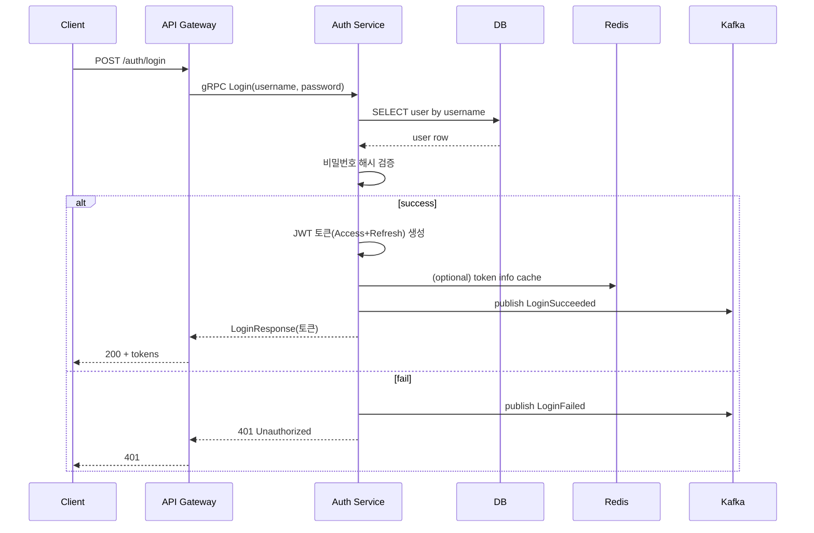

# 인증 흐름 상세 설명

본 문서는 **ImmersiVerse Authentication Service**의 인증(로그인, 토큰 발급, 토큰 검증, 로그아웃 등) 로직이 어떻게 동작하는지, 그 과정에서의 보안 상 주의사항을 정리합니다.

---

## 1. 개요

- **인증 방식**:  
  - 기본: **Username/Password** (내부 DB에 Argon2id 해싱 저장)  
  - 토큰: **JWT**(Access Token + Refresh Token)  
  - 외부 플랫폼(OAuth2.0) 계정 연동(선택)  
- **API Gateway ↔ Auth Service**: gRPC로 통신  
- **유저**는 Gateway를 통해 REST/HTTPS로 `/auth/...` endpoint를 호출 → 내부 gRPC 변환  
- **토큰 저장**: 
  - Access Token은 클라이언트 측(브라우저/모바일) 보관(HTTP 헤더 `Authorization: Bearer ...`)  
  - Refresh Token은 보안이 보장된 스토리지(HTTPOnly 쿠키 or secure keychain 등)

---

## 2. 인증 주요 단계

### 2.1 회원가입

1. **사용자**가 `username`, `email`, `password` 정보를 API Gateway에 `POST /auth/signup` 전송  
2. Gateway → Auth Service (`CreateUser`) gRPC 호출  
3. Auth Service:  
   - 중복 검사(username/email)  
   - 비밀번호 해싱(Argon2id)  
   - DB `users` 테이블 Insert  
   - Kafka에 `UserCreated` 이벤트 발행(통계, 알림 등)  
4. 성공 → 클라이언트에 `UserResponse`

**보안 포인트**:  
- 비밀번호 평문 로그, DB 저장 금지  
- TLS 통신(HTTPS, gRPC TLS)로 암호화

### 2.2 로그인(Username/Password)

1. **사용자**: `POST /auth/login`(username+password)  
2. Gateway → gRPC: `AuthService.Login(LoginRequest)`  
3. Auth Service 로직:  
   - DB에서 `SELECT * FROM users WHERE username=?`  
   - Argon2id 해시 비교  
   - 일치 시 `Access Token(단기 만료), Refresh Token(장기)` 생성  
   - Redis에서 블랙리스트 검증(Optional)  
   - Kafka `LoginSucceeded` or `LoginFailed` 이벤트  
4. **결과**: 로그인 성공 시 토큰 2개를 JSON으로 반환  
   - Access Token 만료시간(예: 15분), Refresh Token(7일 등)

#### 로그인 시퀀스 다이어그램 (Mermaid 예시)

**보안 포인트**:  
- **비밀번호** 틀릴 때, 구체적 메시지 노출 금지 (“Invalid credentials”)  
- **토큰 서명**: RS256/RSA 키 사용(비대칭) 권장  
- **민감로그**: 비밀번호 평문 로깅 금지

### 2.3 액세스 토큰 & 리프레시 토큰

1. **Access Token**:  
   - 수명 짧음(15분 등)  
   - 클라이언트가 API 호출 시 `Authorization: Bearer <access_token>` 헤더로 전송  
   - 갱신 필요 시 Refresh Token 사용
2. **Refresh Token**:  
   - 수명 길음(7일~14일)  
   - 보안 저장(HTTPOnly 쿠키 or secure storage)
3. **Payload**(JWT Claims) 예시:
   - `sub`: user_id  
   - `exp`: 만료 시각(Unix time)  
   - `jti`: unique token ID  
   - `scope` or roles

### 2.4 토큰 검증(Validate)

1. 내부 서비스(또는 API Gateway)에서 Access Token 유효성 검증 시:
   - **서명**(RS256, public key) → 무결성 체크  
   - **만료**(`exp` < now?)  
   - **블랙리스트** 조회(`jti`가 token_blacklist에 있는지)  
   - **scope/roles**(RBAC 필요 시)
2. **Auth Service**는 `ValidateToken(ValidateTokenRequest)` gRPC 메서드를 제공
3. 유효 시 user info, role 등 반환. 무효 시 `UNAUTHENTICATED`에러

---

## 3. 토큰 갱신(RefreshToken Flow)

1. 만료된(혹은 곧 만료) Access Token  
2. 클라이언트가 `POST /auth/refresh`에 Refresh Token을 보내어 새 토큰 발급 요청  
3. Auth Service → Refresh Token 서명, 만료, 블랙리스트 검사  
4. **유효**하면 새 Access + Refresh 발급 → 반환  
5. **무효**면 401 Unauthorized

---

## 4. 로그아웃 / 블랙리스트

### 4.1 로그아웃

1. **클라이언트**: `POST /auth/logout` + 현재 Access Token  
2. Auth Service: 
   - `token_id`(JWT jti) → `token_blacklist` 테이블(or Redis) 추가
   - 이후 이 토큰은 만료 전이라도 무효

### 4.2 블랙리스트 관리

- `token_blacklist`(DB) or Redis key
- 만료 전 무효화된 토큰만 저장
- 정기적(cleanup job)으로 `expires_at < now()` 된 레코드 삭제
- API 호출 시 토큰 jti가 블랙리스트에 있는지 확인

---

## 5. 외부 플랫폼 OAuth 연동(선택)

- **Auth Service**가 Twitch/YouTube 등 플랫폼 계정 연동 시, 외부 OAuth 2.0 코드 교환
- 인증 흐름: 
  1. 클라이언트가 해당 플랫폼 로그인 → auth code 수령
  2. `POST /auth/platform/connect` → Auth Service: `ConnectPlatformAccountRequest`
  3. Auth Service가 외부 OAuth API로 토큰 교환 → `platform_accounts`에 저장
- **보안**:
  - 외부 Access Token/Refresh Token도 안전 저장(암호화?), 만료 시 재발행
  - 사용자 consent, scope 제한

---

## 6. 2FA / MFA (Optional)

- **문서**: 이 서비스가 2FA(One-Time Password, TOTP, SMS) 등을 지원 시
- **흐름**:
  1. User/Pass 1차 인증
  2. 2FA code 검증(Authenticator App, SMS)
  3. 토큰 발급
- **구현**: TOTP(계정 시크릿), QR코드 등록, `POST /auth/2fa/verify` 등 (프로젝트 확장 시 적용)

---

## 7. 시나리오별 요약

### 7.1 사용자 등록 + 로그인

- **회원가입** → DB Insert  
- **로그인** → 비밀번호 해싱 비교 + Access/Refresh 발급  
- **토큰** → JWT RS256 (15분/7일)

### 7.2 만료된 액세스 토큰

- **Refresh** → Refresh Token 검증, 새 토큰 발급

### 7.3 로그아웃

- Access Token의 `jti`를 블랙리스트에 등록  
- Refresh Token도 폐기(Optional) → Refresh Token jti도 블랙리스트

### 7.4 외부 플랫폼 계정 연결

- OAuth code 교환  
- `platform_accounts` Insert  
- Token 만료 시 Auth Service가 refresh(외부)

---

## 8. 보안 고려사항

1. **TLS**: API Gateway ↔ 클라이언트 / Service ↔ DB / Service ↔ Kafka 모두 TLS 권장  
2. **Key Management**: JWT 서명 RS256 private key는 안전하게 Vault/HSM에 보관  
3. **Brute force 보호**: 로그인 실패 횟수 제한(Rate limit or IP ban)  
4. **Session Fixation 방지**: 새 토큰 발급 시 구 토큰 폐기  
5. **Logging 민감정보**: 비밀번호/토큰 평문 노출 금지

---

## 9. 모니터링 및 감사

- **로그인 이벤트**: Kafka `login_succeeded`, `login_failed` → Security/Analytics  
- **AuditLog**: `audit_logs` 테이블에 User 생성/삭제, Role 변경 이력  
- **알림**: 이상 로그인 → Slack/Email 알림(예: 해외 IP?)

---

## 10. 결론

**인증 흐름**에서:

1. Username/Password로 1차 식별 → 비밀번호 해싱 비교  
2. JWT 발급(Access + Refresh)  
3. 만료/로그아웃 시 Refresh Token or 블랙리스트로 관리  
4. 외부 플랫폼 OAuth 연동(선택)  
5. 모든 통신은 TLS, 민감 정보 보호

이 가이드를 준수하면, **Authentication Service**가 안전하고 일관성 있는 인증 서비스를 제공할 수 있습니다. 추후 MFA, SSO, RBAC 확장 시에도 본 문서를 기반으로 흐름을 발전시키시면 됩니다.